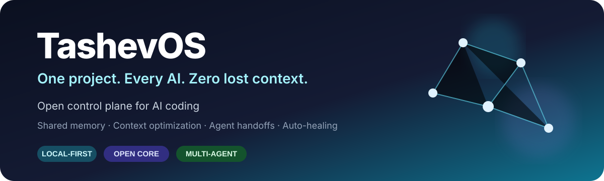
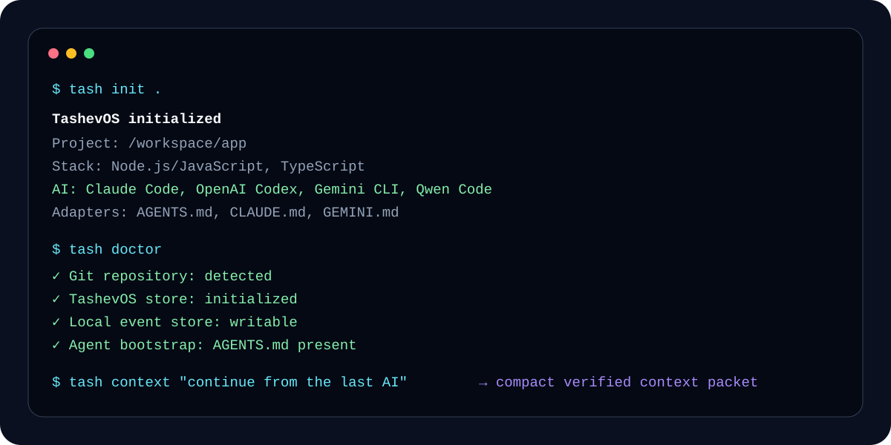
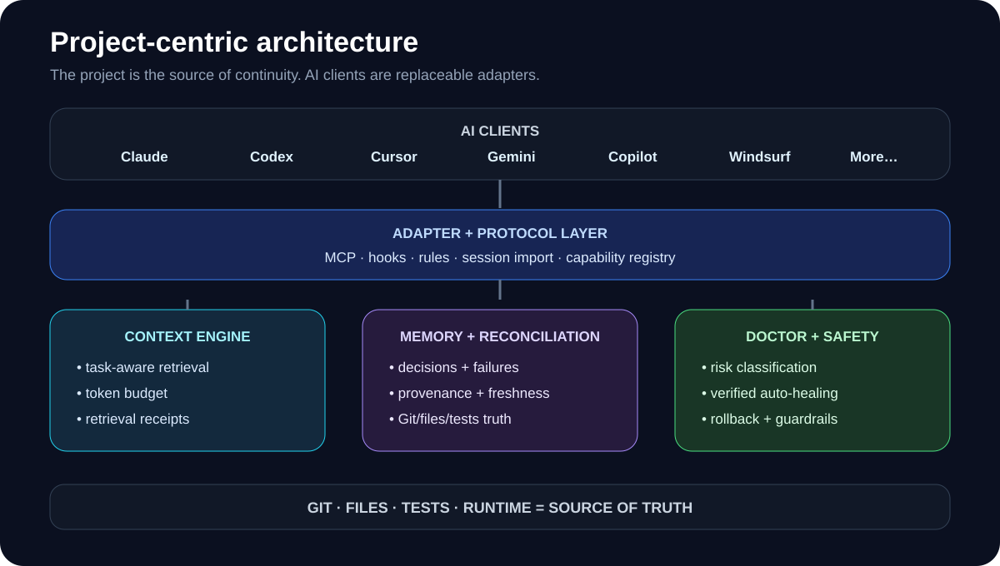
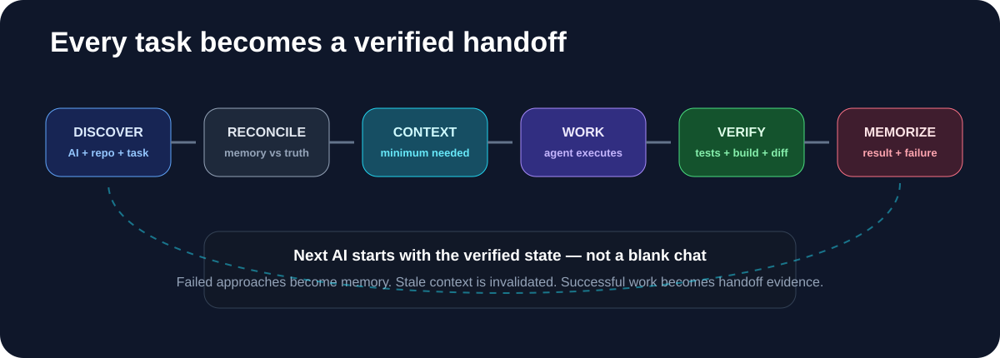

<p align="center">
  
</p>

<p align="center">
  <a href="./README.md">English</a> · <a href="./README.ru.md">Русский</a>
</p>

<p align="center">
  <a href="https://github.com/tashev11/tashevos/releases"></a>
  <a href="./LICENSE"></a>
  =20">
  
  <a href="https://github.com/tashev11/tashevos/stargazers"></a>
</p>

<p align="center">
  <b>The open control plane for multi-agent AI coding.</b><br/>
  Shared project memory, compact context, cross-agent continuity, health checks and verified repair primitives.
</p>

> [!IMPORTANT]
> **TashevOS is currently an alpha foundation.** The CLI, project discovery, AI detection, local event memory, compact context packets and doctor/safe-heal primitives work today. Full session harvesting, MCP lifecycle integration, worktree autopilot and verified application-level auto-healing are being built in public.

## The problem

Claude Code, Codex, Cursor, Gemini and other coding agents are excellent at individual tasks — but they do not naturally share one reliable project memory.

Switch tools and the next agent may need to rediscover the architecture, re-read the same files, repeat an approach that already failed, or modify code while another agent is working from stale context.

**TashevOS puts the project in the center instead of any one AI provider.**

| Without TashevOS | With TashevOS |
|---|---|
| Every AI starts from a different context | One canonical project continuity layer |
| Repository re-reading burns tokens | Task-specific compact context |
| Old decisions live in chat history | Durable decisions with provenance |
| Failed approaches get repeated | Dead-end memory is designed as first-class data |
| “AI says fixed” is easy to trust | Git/files/tests/runtime are the intended source of truth |
| Parallel agents can overwrite work | Conflict detection + worktree isolation are on the roadmap |

## See it in 60 seconds

<p align="center">
  
</p>

```bash
git clone https://github.com/tashev11/tashevos.git
cd tashevos
npm install
npm run build
npm link

# initialize inside any Git project
tash init /path/to/your/project

# see which AI tools TashevOS detects
tash agents /path/to/your/project

# verify continuity health
tash doctor /path/to/your/project

# compile an evidence-first context packet
tash context "fix admin notifications" --path /path/to/your/project
```

### Connect MCP-capable AI clients

```bash
# Claude Code — available in every project
claude mcp add --scope user tashevos -- tash mcp serve

# OpenAI Codex — global MCP server
codex mcp add tashevos -- tash mcp serve

# Gemini CLI: add the same command/args under mcpServers in ~/.gemini/settings.json
```

Compatible clients get `tashevos_context`, `tashevos_status`, `tashevos_handoff` and `tashevos_checkpoint`. Agents without MCP can use `tash context` + `tash handoff` instead.

## Reddit ↔ GitHub automation

TashevOS supports a Reddit Developer Platform app that can automate feedback loops for multiple GitHub repositories from one installation:

```text
GitHub Releases (N repos)
        ↓
Devvit scheduler
        ↓
Reddit app-account posts
        ↓
bug / feature feedback
        ↓
Issue in the originating GitHub repo
        ↓
closed Issue → one reply to the originating Reddit comment
```

The preferred implementation lives in [integrations/reddit-devvit](integrations/reddit-devvit). It checks subreddit rules, deduplicates releases per repository, uses the Reddit app account rather than a personal identity, never votes or sends DMs, and stores GitHub credentials only as a Devvit secret.

The original local OAuth transport remains available through `tash reddit init/auth/tick/install` for approved Reddit Data API use cases. See [docs/REDDIT_BRIDGE.md](docs/REDDIT_BRIDGE.md).

## Publisher Hub

TashevOS can also distribute GitHub releases across developer-facing channels from one deduplicated pipeline. Direct API adapters cover DEV.to, Hashnode, LinkedIn, Telegram, Discord, Bluesky and Mastodon; Reddit stays on the existing Devvit bridge. Platforms where blind API posting is unavailable or inappropriate automatically receive ready-to-publish drafts instead of brittle browser automation.

The configuration lives in `.tashevos/publisher.json`, state is tracked in `.tashevos/publisher-state.json`, and the scheduled workflow is `.github/workflows/publisher.yml`. A macOS `launchd` fallback is included for accounts where GitHub-hosted runners are unavailable. See [docs/PUBLISHER_HUB.md](docs/PUBLISHER_HUB.md), [docs/PUBLISHER_SETUP.md](docs/PUBLISHER_SETUP.md) and [integrations/publisher](integrations/publisher).

## Cross-device continuity

TashevOS can keep an **encrypted work checkpoint** in a private Git remote so another trusted device can continue from the same Git commit **including staged changes, unstaged changes and safe untracked files**. Secret-like files such as `.env*`, private keys and credential files are excluded before encryption. Raw AI sessions remain local-only.

```bash
# once per device
tash sync init --remote git@github.com:YOU/tashevos-state.git

# enable automatic checkpoints for this project
tash autosync add /path/to/project --task "finish the billing refactor"
tash autosync install --interval 300

# manual checkpoint is still available at any time
tash checkpoint "finish the billing refactor"

# on another clone/device
tash sync init --remote git@github.com:YOU/tashevos-state.git --key "$(...recovery key...)"
tash sync status
tash resume
```

The recovery key is generated locally and never written to the vault. Retrieve it only when enrolling another trusted device with `tash sync key`. The remote stores an AES-256-GCM + scrypt encrypted payload; Git history gives you previous checkpoint versions.

**Autosync is change-aware:** it fingerprints the Git HEAD, staged changes, unstaged changes and safe untracked files. Unchanged states are skipped, secret-like untracked files do not trigger a checkpoint, and a manual checkpoint is not duplicated by the next background pass. The built-in service installer uses macOS `launchd` or a Linux user `systemd` timer; other platforms can schedule `tash autosync tick`.

## What works today

The current alpha already provides:

- **Project discovery** — find the Git root and detect the stack/package manager.
- **AI environment detection** — current detectors cover Claude Code, Codex, Cursor, Gemini CLI, Copilot, Windsurf, Kiro, Cline, Roo, OpenCode, Continue, Qwen, Zed and Aider markers.
- **History source discovery** — locate known local history/session stores when available.
- **Local event primitives** — append project-control events locally instead of dumping raw sessions into Git.
- **Managed agent bootstrap** — idempotent TashevOS blocks for `AGENTS.md`, `CLAUDE.md` and `GEMINI.md`.
- **Evidence-first context packets** — combine the current Git state, project memory, guardrails and recent TashevOS events.
- **MCP continuity server** — `tash mcp serve` exposes context, status, handoff and checkpoint tools to compatible AI clients.
- **Durable handoff** — `tash handoff` updates the canonical `STATE.md` so the next agent can continue from a compact task summary.
- **Doctor** — inspect Git, TashevOS storage and bootstrap health.
- **Safe healing primitives** — repair TashevOS-owned metadata/integration files only.
- **Local-first privacy model** — runtime events and raw session data are ignored by Git by default.

## How TashevOS is designed

<p align="center">
  
</p>

The long-term goal is not another passive memory database. TashevOS should answer:

> **What is actually true about this project right now, what did every AI already try, what failed, what minimum context does the next agent need, and is it safe to continue?**

The evidence hierarchy is intentional:

```text
runtime / tests / CI
        ↓
current files + Git
        ↓
verified memory
        ↓
agent summaries
        ↓
inference
```

An AI claim should never silently override repository evidence.

## Every task should become a verified handoff

<p align="center">
  
</p>

The target lifecycle is:

```text
discover
  → reconcile memory with current project truth
  → retrieve the minimum relevant context
  → let the selected agent work
  → verify with configured evidence
  → memorize the result or failed approach
  → hand off cleanly to the next agent
```

This is the foundation for switching between Claude, Codex, Cursor, Gemini and future agents without repeatedly explaining the same project.

## CLI

| Command | Purpose |
|---|---|
| `tash init [path]` | Initialize TashevOS in a Git project |
| `tash status [path]` | Show Git and local memory status |
| `tash agents [path]` | Detect AI tools and known history sources |
| `tash scan [path]` | Detect the project stack |
| `tash context [task]` | Compile a compact evidence-first context packet |
| `tash handoff <task>` | Record task, summary, next step and blockers for the next agent |
| `tash mcp serve` | Start the stdio MCP continuity server |
| `tash doctor [path]` | Inspect continuity/integration health |
| `tash doctor --fix` | Repair safe TashevOS integration issues |
| `tash heal [path]` | Run the current safe-healing pass |
| `tash checkpoint [task]` | Save an encrypted cross-device work checkpoint |
| `tash resume [path]` | Restore the latest checkpoint |
| `tash sync init/status/key` | Configure and inspect the encrypted vault |
| `tash autosync add [path]` | Register a project for automatic checkpoints |
| `tash autosync install --interval 300` | Install the background scheduler |
| `tash autosync status` | Show registered projects and last result |
| `tash reddit init/auth/status` | Configure and inspect the Reddit ↔ GitHub bridge |
| `tash reddit tick/install` | Run once or install the background Reddit bridge |

## Project memory

TashevOS creates a small tracked control layer:

```text
.tashevos/
├── config.json
├── PROJECT.md
├── STATE.md
├── GUARDRAILS.md
├── memory/
│   ├── decisions.ndjson
│   └── failed-approaches.ndjson
├── local/       # ignored by Git
├── cache/       # ignored by Git
└── sessions/    # ignored by Git
```

The design deliberately separates **durable project facts** from **private raw histories**.

Read the full model: [docs/MEMORY_MODEL.md](docs/MEMORY_MODEL.md)

## AI ecosystem

TashevOS is vendor-neutral by design. The compatibility plan covers 30+ coding environments and three integration levels:

- **FULL** — lifecycle integration through hooks/MCP/CLI plus automatic context/event capture.
- **NATIVE** — rules/instruction integration with limited lifecycle capture.
- **BRIDGE** — Git/GitHub/handoff integration for closed platforms.

Current and planned environments include Claude Code, OpenAI Codex, Cursor, Gemini CLI, GitHub Copilot, Windsurf, Kiro, Cline, Roo Code, OpenCode, Continue, Qwen Code, Zed, Aider, Junie, Amp, Goose, Devin, OpenHands, Replit Agent, Jules, Lovable, Bolt, v0 and more.

See the honest implementation matrix: **[docs/COMPATIBILITY.md](docs/COMPATIBILITY.md)**

## Verified auto-healing

TashevOS is designed around a strict rule:

> **“The agent says it is fixed” is not verification.**

The planned repair loop is:

```text
diagnose
  → classify risk
  → checkpoint
  → repair
  → run relevant verification
  → accept or rollback
  → remember what happened
```

Safe TashevOS-owned repairs exist in the alpha. Application-level verified healing is a roadmap capability.

Read the safety contract: [docs/AUTO_HEALING.md](docs/AUTO_HEALING.md)

## Roadmap

### v0.2 — Universal Session Harvester
Import and correlate real local histories from supported AI clients.

### v0.3 — Memory Intelligence
Provenance, trust, freshness, contradictions, dead-end firewall and retrieval receipts.

### v0.4 — MCP + Lifecycle Hooks
Automatic context injection and event capture.

### v0.5 — Multi-agent Safety
Stale-context detection, file claims and worktree autopilot.

### v0.6 — Verified Auto-healing
Risk-aware repair, verification and rollback.

### v0.7 — Token + Cost Governor
Real context accounting, budgets, cache and reproducible savings benchmarks.

See the full plan in **[ROADMAP.md](ROADMAP.md)** and the open [roadmap issues](https://github.com/tashev11/tashevos/issues?q=is%3Aissue+is%3Aopen+label%3Aroadmap).

## Principles

1. **Zero manual memory** for routine continuity.
2. **Every AI action should be traceable.**
3. **Facts beat agent claims.**
4. **Retrieve context — do not dump repositories.**
5. **Repairs must be verified and reversible.**
6. **Local-first by default.**
7. **No single AI vendor owns project truth.**
8. **Failed work is valuable memory.**
9. **Stale memory is unsafe memory.**
10. **Adapters are replaceable; project continuity is durable.**

More: [docs/PRINCIPLES.md](docs/PRINCIPLES.md)

## Built for an ecosystem

The core stays provider-neutral. New AI environments should be added through adapters instead of growing provider-specific conditionals in the engine.

The adapter SDK contract lives in [packages/sdk](packages/sdk) and is licensed under **Apache-2.0** so vendors and community projects can integrate without inheriting the core license.

## Contributing

The project is intentionally being built in public.

Good places to start:

- browse [open issues](https://github.com/tashev11/tashevos/issues);
- pick the [good first issue](https://github.com/tashev11/tashevos/issues?q=is%3Aissue+is%3Aopen+label%3A%22good+first+issue%22);
- add or improve an AI adapter detector;
- challenge the memory/reconciliation model;
- help build reproducible token-savings benchmarks.

Please read [CONTRIBUTING.md](CONTRIBUTING.md), [ARCHITECTURE.md](ARCHITECTURE.md), [SECURITY.md](SECURITY.md) and [CLA.md](CLA.md).

## Licensing

- **TashevOS Core:** AGPL-3.0-only
- **Adapter SDK / protocol packages:** Apache-2.0
- **Future Cloud / Team / Enterprise services:** may be commercial

Commercial licensing for organizations that cannot use AGPL is planned.

## Security & privacy

TashevOS may interact with source code, AI histories and developer tooling, so privacy is a product constraint rather than an afterthought.

- raw sessions are local-only by default;
- secrets should never enter tracked memory;
- external text is treated as untrusted input;
- destructive repair needs stronger authorization than metadata repair;
- repository evidence outranks remembered agent statements.

See [SECURITY.md](SECURITY.md).

---

<p align="center">
  <b>TashevOS — One project. Every AI. Zero lost context.</b><br/>
  If the idea solves a real problem for your workflow, try the alpha, open an issue, or follow the project as it evolves.
</p>
